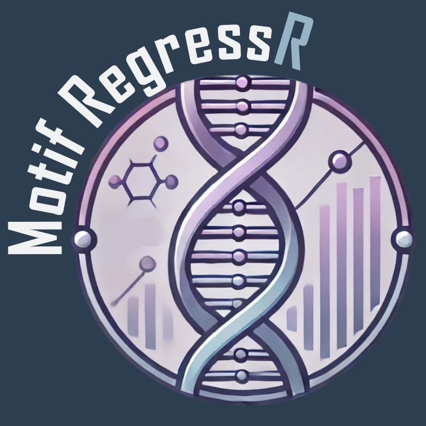

# Advanced genomics project: MotifRegressR

  

This project was developed as part of the Advanced genomics course within the Master's degree in 
Bioinformatics for Computational Genomics. It consists in an R package and a dedicated shinyR application
for motif regression.

## Team
The project was developed by 
- [Leonardo Nossa](https://github.com/LeonardoNossa),
- [Gabriele Oliveto](https://github.com/Gab-23),
- [Marco Cominelli](https://github.com/marco-cominelli01),
- [Teodor Devda](https://github.com/doroteo17),
- [Elena Sasso](https://github.com/elenasasso),
- [Riccardo de Sury](https://github.com/riccardodesury),
- [Federico Camozzi](https://github.com/Federico-Camozzi), 
- [Laura Mottarlini]() 

## Project Overview
This R package facilitates motif analysis for gene expression studies. 
It integrates upstream DNA sequence information, gene expression profiles, and 
Position Frequency Matrices (PFMs) to identify regulatory motifs influencing 
gene expression.

Users can import PFMs from JASPAR or custom sources, annotate genomic sequences 
with transcription start sites (TSS), and retrieve metadata of gene expression 
conditions.

The package scores motifs across genes, aggregates the results, and performs 
regression analysis to determine the most impactful motifs under different 
experimental conditions. Visualization functions finally help the user in the 
sense-making step of the analyses.

## How to Use This Repository

Instructions on how to install and use the tool are provided in the [Vignette.Rmd](Vignettes/MotifRegressR.Rmd) file in the [Vignettes](Vignettes) folder.
You can find all the functions' scripts in the [R](R) folder and all the documentation about them in the [man](man) folder. 
Inside the [inst/extdata](inst/extdata) folder you will find some example data on which to try the analyses.
Please make sure R software and all depdendencies are correctly installed before installing the package.

## Contact
For any additional questions or feedback, please contact [Leonardo Nossa](mailto:leonardo.nossa@studenti.unimi.it).
